# 	Seaborn的用法、用处、实例

 

Seaborn 是一个对 matplotlib 进行高级封装的图形可视化库，具有着与 pandas 统一的数据结构。运用 seaborn, 我们可以通过极简的代码绘制出美观并具有分析价值的图表。


## 一、可视化统计关系

> 以 tips、fmri 数据库为例，以 Seaborn 中的 relplot 函数为接口，分析各变量之间的关系

在此，我们介绍 seaborn 中的 relplot 函数——它封装了绘制散点图的 scatterplot 函数和绘制线图的 lineplot 函数，我们可以通过 relplot 函数中的 kind 参数来选择调用上述二者。

```python
def relplot(
    *,
    x=None, y=None,
    hue=None, size=None, style=None, data=None,
    row=None, col=None,
    col_wrap=None, row_order=None, col_order=None,
    palette=None, hue_order=None, hue_norm=None,
    sizes=None, size_order=None, size_norm=None,
    markers=None, dashes=None, style_order=None,
    legend="auto", kind="scatter",
    height=5, aspect=1, facet_kws=None,
    units=None,
    **kwargs
):
```

relplot 函数的定义如上，我们可以通过调整众多的参数来实现图像的调控；然而在实际运用中，我们一般只需调整少数几个参数，其他的保持默认值，便能绘制出较为精美的图表

```python
sns.relplot(x='x_data', y='y_data', kind='scatter', data=data_set) 
# x_data指充当x轴方向的数据的索引名，y_data同理。kind参数可指定绘制的图表类型
# kind='scatter'，绘制的是散点图；kind='line'，绘制的是线型图
# data=data_set 中的data_set指的是绘制图表的数据库对象名
```

### relplot函数的运用之散点图

下面以 seaborn 官方内置数据库 tips 为例，分析顾客所付小费与相关数据之间的相关性

* 可以采用官网上的方式直接导入，但一般因为网络问题而失败

```python
tips = sns.load_dataset("tips")
```

* 可以先下载 seaborn 内置数据库，进行本地访问（下载网址：https://github.com/mwaskom/seaborn-data）

* tips 数据库的前五行如下

  ```
     total_bill   tip     sex smoker  day    time  size
  0       16.99  1.01  Female     No  Sun  Dinner     2
  1       10.34  1.66    Male     No  Sun  Dinner     3
  2       21.01  3.50    Male     No  Sun  Dinner     3
  3       23.68  3.31    Male     No  Sun  Dinner     2
  4       24.59  3.61  Female     No  Sun  Dinner     4
  ```

绘制 tip 与 total-bill 之间关系的散点图的示例代码如下

```python
import seaborn as sns
import pandas as pd
import matplotlib.pyplot as plt


df = pd.read_csv("seaborn-data-master/tips.csv")
print(df.head())
sns.relplot(x="total_bill", y="tip", data=df)
plt.show()
```

绘制图表结果如下：

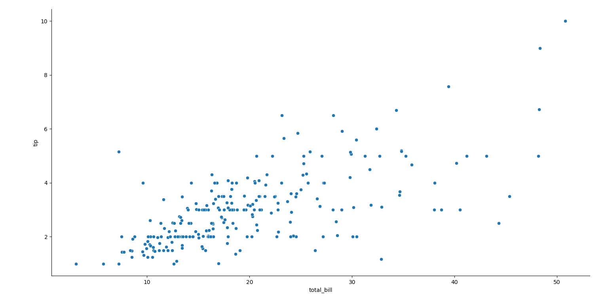

#### relplot函数中的几个语义映射参数

我们能够通过进一步细化参数值，来使图表反映出更多信息，下面介绍三个额外的参数：hue, style, size. 它们能够将相关数据特征映射到图表中的点的色调、样式和大小等图像特征上。

示例代码：

```python
import seaborn as sns
import pandas as pd
import matplotlib.pyplot as plt


df = pd.read_csv("seaborn-data-master/tips.csv")
print(df.head())
sns.relplot(x="total_bill", y="tip", 
			hue="smoker",  # 根据数据库中smoker条目的值，而使点呈现出不同的颜色
			style="sex",  # 根据数据库中sex条目的值，而使点呈现出不同的样式
			size='size',  # 根据数据库中size条目的值，而使点呈现出不同的大小
			data=df)
plt.show()
```

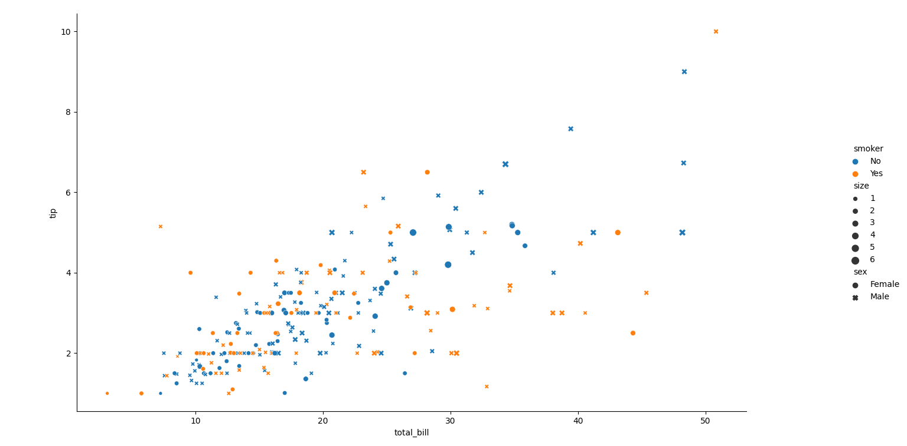

#### relplot函数中的col参数

我们也可以通过设定 relplot 函数中的 col 参数的值，来分类绘制样式一致的多个子图, 这样能实现快捷地分类分析，而不必逐个进行子图的绘制

示例代码：

```python
import seaborn as sns
import pandas as pd
import matplotlib.pyplot as plt


df = pd.read_csv("seaborn-data-master/tips.csv")
print(df.head())
# 通过设定col参数，来分类绘制不同时间用餐的人群数据散点图
sns.relplot(x="total_bill", y="tip", hue="smoker", style="sex", size='size', data=df, col='time')
plt.show()
```

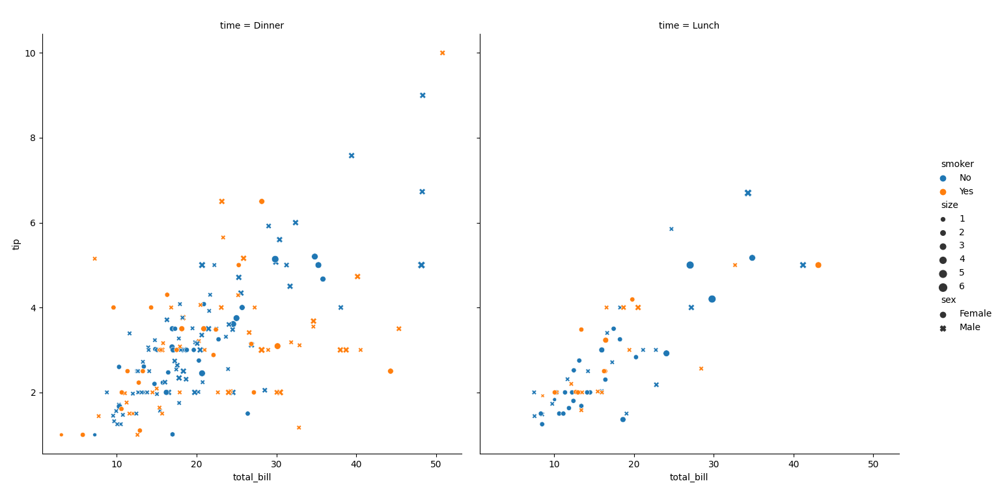

### relplot函数的运用之线型图

relplot 函数不仅能绘制散点图，还能通过数据生成线型图及相关的置信区间，下面以 fmri 的数据库为例绘制线型图。

fmri 数据库的前五行如下：

```
  subject  timepoint event    region    signal
0     s13         18  stim  parietal -0.017552
1      s5         14  stim  parietal -0.080883
2     s12         18  stim  parietal -0.081033
3     s11         18  stim  parietal -0.046134
4     s10         18  stim  parietal -0.037970
```

示例代码：

```python
import seaborn as sns
import pandas as pd
import matplotlib.pyplot as plt


df = pd.read_csv("seaborn-data-master/fmri.csv")
ax = sns.relplot(x="timepoint", y="signal", kind='line', data=df) # 设置kind参数为‘line'
plt.show()
```

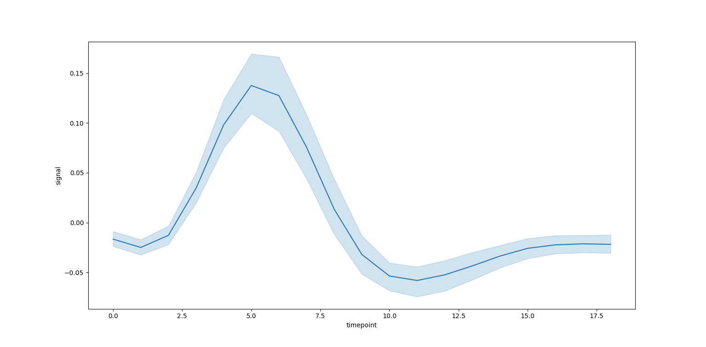

## 

注意到这里对于相同的x轴变量有许多不同的观测值，seaborn 默认绘制观测值的平均数曲线与95%的置信区间，十分快捷的展现出数据之间的相关性与变化趋势。

#### relplot函数中的ci参数

可以通过修改 ci 参数，来取消绘制置信区间，用其他方式来展现数据的分布范围

```python
ax = sns.relplot(x="timepoint", y="signal", kind='line', data=df)  # 默认形式，绘制平均值及置信区间 
ax = sns.relplot(x="timepoint", y="signal", kind='line', data=df, ci= None)  # 取消绘制置信区间
ax = sns.relplot(x="timepoint", y="signal", kind='line', data=df) # 取消绘制置信区间，借助标准差来展现数据分布范围
```

#### 线型图美化

与散点图一样，我们能通过 hue，style 参数来使线型图更加多样化

示例代码

```python
import seaborn as sns
import pandas as pd
import matplotlib.pyplot as plt


df = pd.read_csv("seaborn-data-master/fmri.csv")
sns.relplot(x="timepoint", y="signal", kind='line', data=df, hue='event', style='event')  # 根据event条目的值来设置不同的线段样式 
plt.show()
```

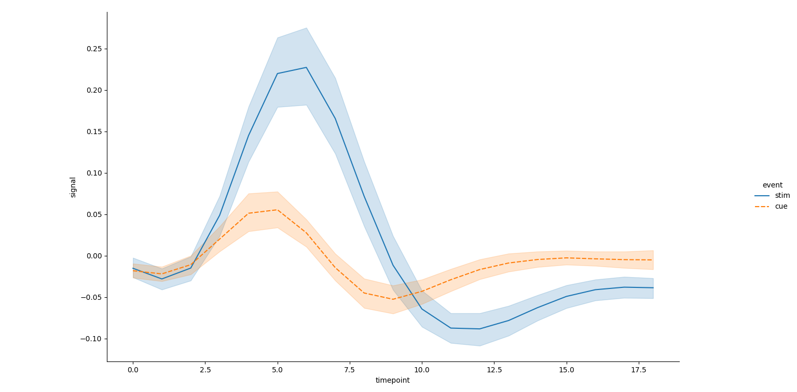


## 二、可视化分类数据

> 以tips,titanic数据库为例，以Seaborn中的catplot函数为接口，对数据库数据进行分类

在上一节，我们利用 relplot 接口绘制了描述不同变量之间关系的图表；接下来，我们将应用 catplot 接口来实现数据分类的可视化。常见的数据分类图表有**条形图、散点图、箱线图**等，以下将一一提供对应的实例。

### catplot接口

catplot 接口的使用与 relplot 接口是十分类似的，其定义如下：

```python
def catplot(
    *,
    x=None, y=None,
    hue=None, data=None,
    row=None, col=None,  # TODO move in front of data when * is enforced
    col_wrap=None, estimator=np.mean, ci=95, n_boot=1000,
    units=None, seed=None, order=None, hue_order=None, row_order=None,
    col_order=None, kind="strip", height=5, aspect=1,
    orient=None, color=None, palette=None,
    legend=True, legend_out=True, sharex=True, sharey=True,
    margin_titles=False, facet_kws=None,
    **kwargs
):
```

**我们可以通过 kind 参数来指定图表的类型，常见的被 catplot 接口封装的绘图函数及对应的 kind 参数如下：**

* 分类散点图
  * stripplot(), kind=‘strip’（默认值）
  * swarmplot(), kind=‘swarm’
* 分类分布图
  * boxplot(), kind=‘box’
  * violinplot(), kind=‘violin’
  * boxenplot(), kind=‘boxen’
* 分类估计图
  * pointplot(), kind=‘point’
  * barplot(), kind=‘bar’
  * countplot(), kind=‘count’

**同时注意到在 catplot 中，依旧支持 hue 参数，但并不支持 size 和 style 参数**

### 分类散点图的绘制

我们可以借助 catplot 绘制两种分类散点图，分别为 stripplot 和 swarmplot。两者的区别在于，swarmplot 为了避免数据点在图表中互相重叠的现象，而应用了一种使数据沿分类轴分布的算法，以便更好地观测分布。

代码如下：

```  python
import seaborn as sns
import pandas as pd
import matplotlib.pyplot as plt


tips = pd.read_csv('seaborn-data-master/tips.csv')
print(tips.head())
fig, ax_arr = plt.subplots(1, 2, figsize=(8,10))

plt1 = sns.stripplot(x='day', y='total_bill', data=tips, ax=ax_arr[0])  # 绘制stripplot
plt1.set(title='stripplot')
plt2 = sns.swarmplot(x='day', y='total_bill', data=tips, ax=ax_arr[1])  # 绘制stripplot
plt2.set(title='swarmplot')
plt.show()
```

绘制的图表

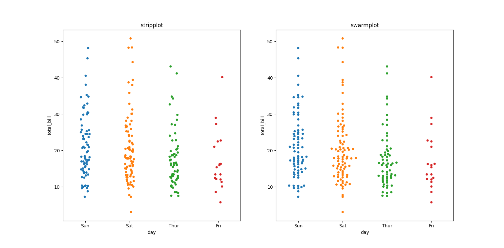

注意，这里并没有使用 catplot 绘制，原因是 catplot 接口是一个 figure-level 的接口，不便实现多个子图的绘制（axes-level）, 所以在此直接调用了被 catplot 封装的函数 stripplot() 和 swarmplot()，并绘制在一张图中，便于比较。

#### jitter、order、hue关键字的使用

* 在 stripplot() 中有一种特殊的关键字叫做 jitter,其默认值为 True,可以通过调控 jitter 参数来控制数据点的左右抖动与否。

* 而 hue 关键字的作用效果与 relplot 中的效果是一致的，在此不赘述。

* order 关键字则起到了指定分类轴上各分类词条排布顺序的作用

示例代码：

```python
import seaborn as sns
import pandas as pd
import matplotlib.pyplot as plt


tip = pd.read_csv('seaborn-data-master/tips.csv')
# 禁用jitter， 添加'sex'的图例，指定了分类轴上各分类条目的顺序
sns.catplot(kind='strip', x='smoker', y='tip', hue='sex', jitter=False, order=['No', 'Yes'], data=tip)
plt.show()
```

绘制的图表

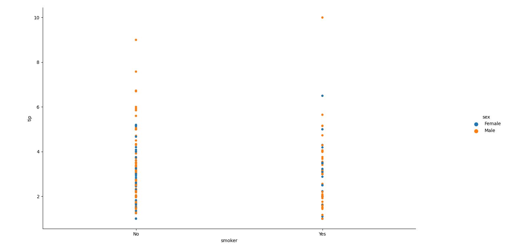

### 分类分布图

散点图能处理的数据集的规模是有限的，过多的数据会导致大量数据点的互相重叠，不利于分布分析。因此，接下来将介绍使用箱线图和条形图进行绘制。

#### 箱线图

示例代码

```python
import seaborn as sns
import pandas as pd
import matplotlib.pyplot as plt


tip = pd.read_csv('seaborn-data-master/tips.csv')
sns.catplot(kind='box', x='day', y='total_bill', data=tip)
plt.show()
```

绘制图表

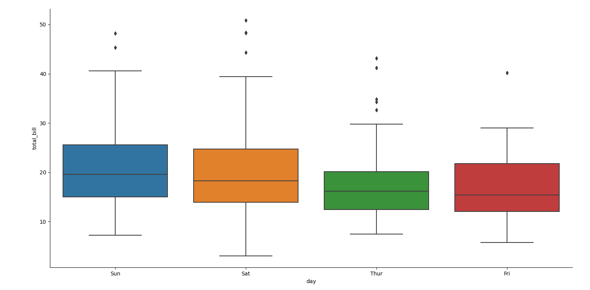

#### 条形图

calplot 中的条形图绘制有两种函数，一者为 barplot，另一者为 countplot

##### barplot

```python
import seaborn as sns
import pandas as pd
import matplotlib.pyplot as plt


titanic = pd.read_csv('seaborn-data-master/titanic.csv')
sns.catplot(kind='bar', x='sex', y='survived', hue='class', data=titanic)  # 指定kind参数为bar
plt.show()
```

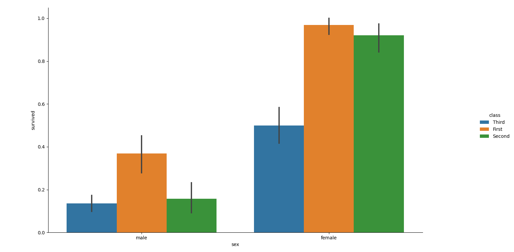

注意到对于多个观测值，seaborn 会自动计算数据的平均值和置信区间，方便进行数据分析（分析结果是一等舱人士的存活率大于其他等级舱的乘客，女性存活率远大于男性存活率）

##### countplot

我们还可以使用 countplot 函数来对某一条目进行分类，并自动统计各个类别的数目

```python
import seaborn as sns
import pandas as pd
import matplotlib.pyplot as plt


titanic = pd.read_csv('seaborn-data-master/titanic.csv')
sns.catplot(kind='count', x='deck', data=titanic, order=['A', 'B', 'C', 'E', 'F', 'G'], palette='ch:.25')
plt.show()
```

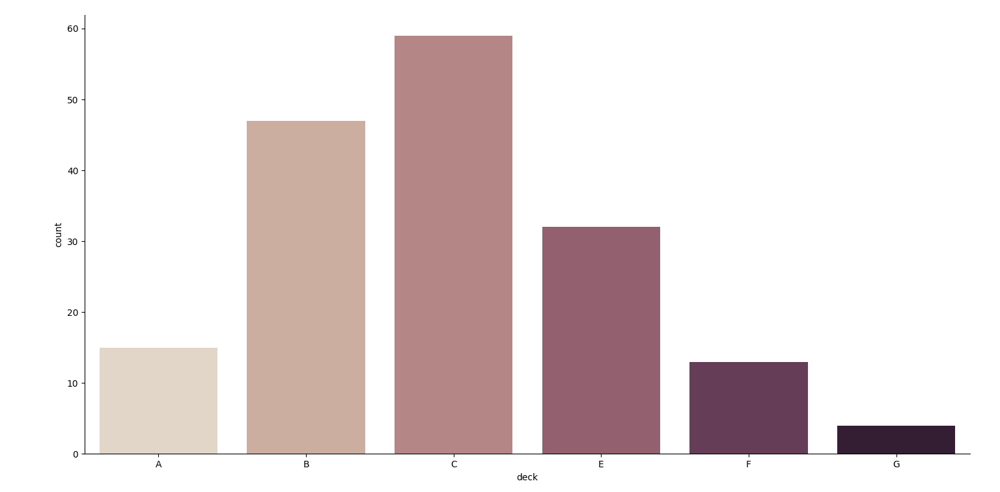


## 三、可视化数据集的分布

除了对数据进行关系分析与分类分析，有时我们还需要研究数据集中各数据的分布情况，本节将介绍 seaborn 中关于数据分布分析的一些常用工具

### 单变量分布

```python
import seaborn as sns
import numpy as np
import matplotlib.pyplot as plt


df = np.random.normal(size=100)  # 生成一个正态分布的数据集
sns.displot(data=df, kde=True, rug=True)  # kde为核密度估计，用于计算密度函数；rug对应于观测值分布轴上的一个个垂直刻度，同样能展现数据的分布密度
plt.show()
```

绘制图表

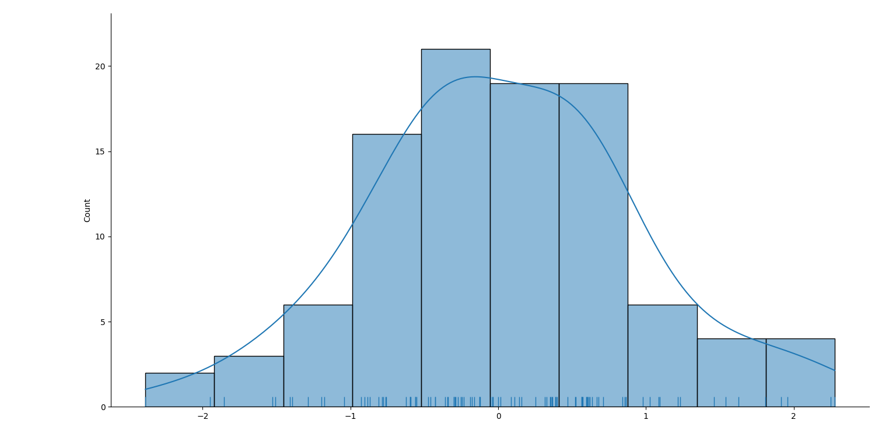

### 二元变量分布

我们还可以使用 seaborn 中的 jointplot 函数来进行二元变量的分布分析

```python
import numpy as np
import seaborn as sns
import pandas as pd
import matplotlib.pyplot as plt

mean, cov = [0, 1], [(1, .5), (.5, 1)]  # mean指多元变量的均值，而cov则是描述数据分布的协方差矩阵
data = np.random.multivariate_normal(mean, cov, 200)
df = pd.DataFrame(data, columns=["x", "y"])
sns.jointplot(x='x', y='y', data=df)  # jointplot的默认图表类型为散点图
plt.show()
```

绘制图表

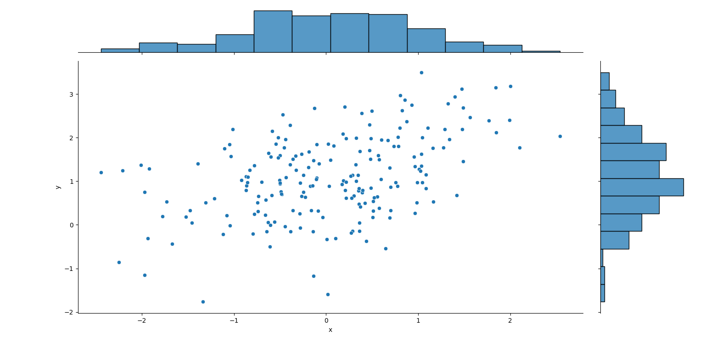


## 四、线性关系可视化

在处理数据时，我们还可以利用 seaborn 中的 regplot 和 lmplot 来进行数据的线性回归，下面将介绍这两个函数的使用

### regplot和lmplot的使用区别

以下为两者的一般调用方式：

```python
sns.regplot(x='total_bill', y='tip', data=tips);
sns.lmplot(x='total_bill', y='tip', data=tips)
```

可见两者的大致调用方式是与之前的函数类似的，依靠‘x’关键字来指定x轴数据，‘y’关键字来指定y轴数据，‘data’关键字来指定数据库。

然而，在 regplot 函数中，data 关键字并非必填项，而’x’ 和 ‘y’关键字能接收的数据类型范围广泛，包括 numpy 数组，Series 对象等等。而在 lmplot 函数，data 关键字为必填项，’x’和‘y’关键字也只能接受字符串类型的数据（即数据库的索引）

不过，由于 lmplot 函数能实现 regplot 函数所有的功能且实现方式类似，因此接下来的演示将以 lmplot 函数的使用为主

### lmplot函数的使用

```python
import seaborn as sns
import pandas as pd
import matplotlib.pyplot as plt


df = pd.read_csv('seaborn-data-master/tips.csv')
print(df.head())
sns.lmplot(x='total_bill', y='tip', data=df)
plt.show()
```

绘制图表

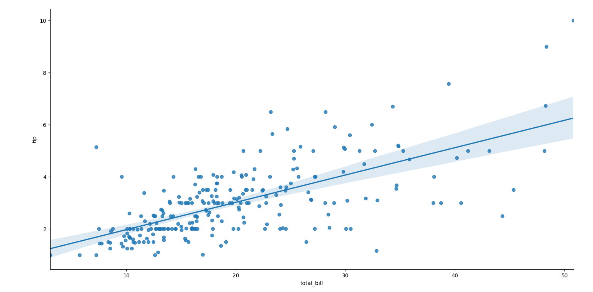

#### 离散数据的线性可视化

当处理离散数据的可视化时，难免会遇到数据点重合的情况（参考之前散点图的绘制），因此可以设置 x_jitter 和 y_jitter 参数，来避免数据重叠

```python
import seaborn as sns
import pandas as pd
import matplotlib.pyplot as plt


df = pd.read_csv('seaborn-data-master/tips.csv')
print(df.head())
sns.lmplot(x='size', y='tip', x_jitter=0.05, data=df)  # 设置x_jitter,防止数据在x轴方向重叠
plt.show()
```

绘制图表

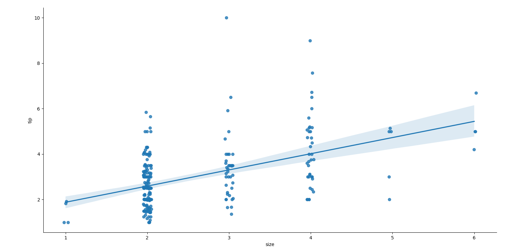

### 非线性回归

lmplot 函数不仅可实现线性回归，还能进行以多项式为基础的非线性回归，方法是设置 order 关键字的值。

示例代码：

```python
import seaborn as sns
import pandas as pd
import matplotlib.pyplot as plt


df = pd.read_csv('seaborn-data-master/tips.csv')
print(df.head())
sns.lmplot(x="total_bill", y="tip", data=df, order=3)  # 指定order为3,即为三次多项式模拟
plt.show()
```

绘制图表

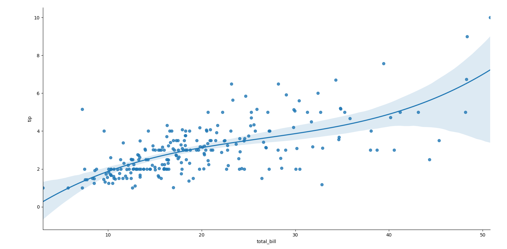

### hue, col的使用

之前提到的 hue，col 关键字同样可以在 lmplot 中使用，方式类似，可以参考之前的教程

## 五、Seaborn图表美化

### 调整配色

seaborn 图表既可以自定义配色，又可以使用既定的几种配色方案，使图像更加美观

#### 分类调色板

分类调色板主要应用于区分没有内在联系的离散数据，可以使用 color_palette 来定义调色板。

默认主题有六种变体，分别为 deep,muted,pastel,bright,dark,colorblind.

示例代码

```python
import seaborn as sns
import pandas as pd
import matplotlib.pyplot as plt


sns.color_palette('pastel')
titanic = pd.read_csv('seaborn-data-master/titanic.csv')
sns.catplot(kind='count', x='deck', data=titanic, order=['A', 'B', 'C', 'E', 'F', 'G'], palette=sns.color_palette('pastel'))  # 在calplot函数中指定palette关键字，以此修改配色（在这里指定了pastel配色方案）
plt.show()
```

绘制图表

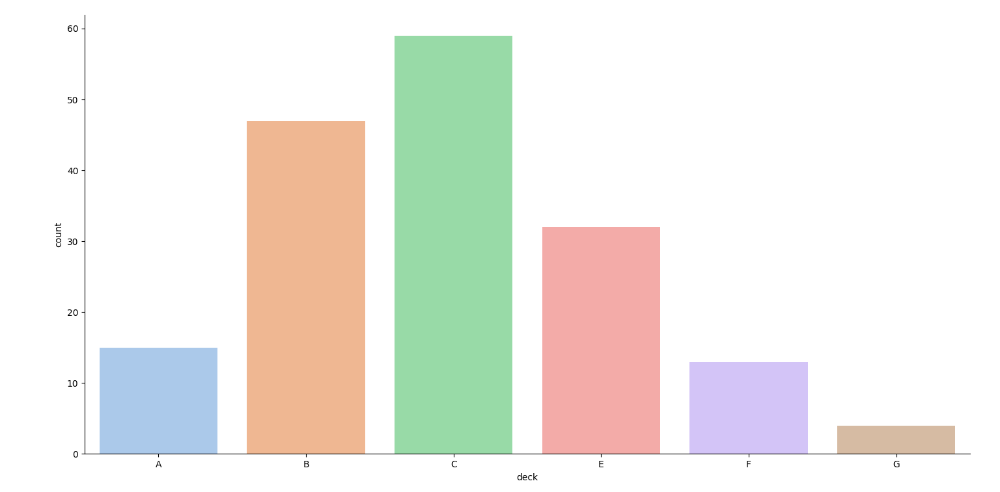

当然也可以采用自定义的方式，可以使用 husl 系统来生成特定种类的变化均匀的颜色

示例代码：

```python
import seaborn as sns
import pandas as pd
import matplotlib.pyplot as plt


pal = sns.color_palette('husl', 6)  #"husl"为颜色系统的名字，而数字6代表想生成的色块种类数目
titanic = pd.read_csv('seaborn-data-master/titanic.csv')
sns.catplot(kind='count', x='deck', data=titanic, order=['A', 'B', 'C', 'E', 'F', 'G'], palette=pal)
plt.show()
```

绘制图表

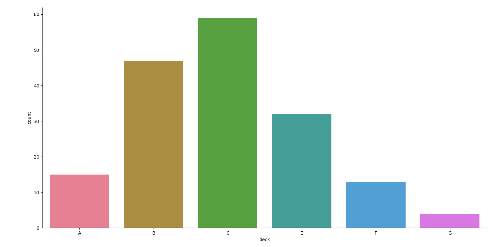

#### 顺序调色板

当我们想通过颜色的深浅来区分不同分类之间的渐进关系时，可以采用顺序调色板，在这里介绍一种基础的使用方法

示例代码

```python
import seaborn as sns
import pandas as pd
import matplotlib.pyplot as plt


pal = sns.color_palette("Blues")  # 这里输入Blues，同理可以输入其他颜色如"Reds"""Greens""Purples"等，可以添加尾缀
titanic = pd.read_csv('seaborn-data-master/titanic.csv')
sns.catplot(kind='count', x='deck', data=titanic, order=['A', 'B', 'C', 'E', 'F', 'G'], palette=pal)
plt.show()
```

绘制图表

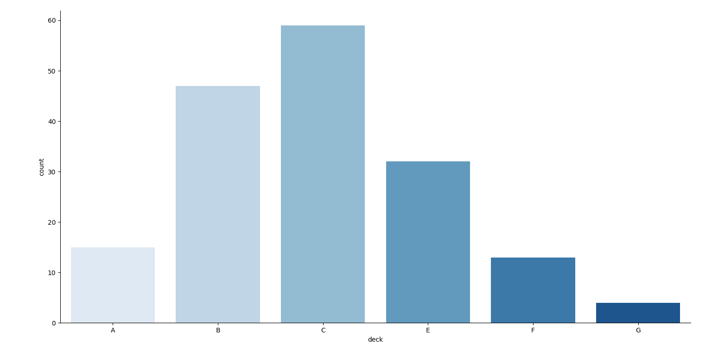

**可以在“Blues”后面加入尾缀“_r”，使色块深浅分布倒置**

### 风格设置

seaborn 设置图表风格的方式主要有三种：

* set（通用设置接口）
* set_style（修改全局设置的接口）
* axes_style（修改子图级别风格的接口）

官方提供的风格有以下五种

- darkgrid，默认风格
- whitegrid
- dark
- white
- ticks

### 环境设置

- set，通用设置接口
- set_context，全局环境设置
- plotting_context，设置当前图（axes级）的绘图环境

当前支持的绘图环境主要有4种：

- notebook，默认环境
- paper
- talk
- poster

这些绘图环境主要改的是图表的字体大小

