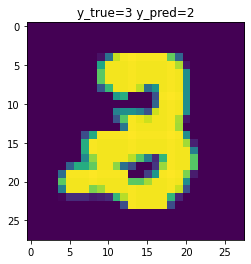
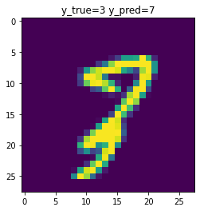

# 图像数据建模：CNN

在 PyTorch 中，对数据进行建模的一般流程是：

1. 加载数据：读入数据，划分数据集，定义数据加载器；
2. 深度学习；定义神经网络，训练神经网络，测试神经网络。

下面将以手写数字识别为例，介绍如何使用 PyTorch 进行图像分类。

**说明：**为便于理解，本文会在每段代码之后直接给出这段代码的输出。

## 1 加载数据

这里选用的是经典的 MNIST 手写数字数据集，其中包含了 70000 张 28×28 的手写数字扫描图片，每张图片中包含一个 0~9 的数字（如下图）。现在的任务是要训练一个神经网络来识别每张图片中的数字。


### 1.1 读入数据

MNIST 数据集可以在[这个链接](https://www.kaggle.com/avnishnish/mnist-original)下载。加载 MNIST 数据集的代码如下。

**说明：**因为 MNIST 是一个经典数据集，其实可以直接使用 `torchvision` 库来加载 MNIST 数据集。这里为了演示加载数据的一般流程，没有采用这种方法。

```py
from scipy.io import loadmat
import torch

# 选择计算设备（当GPU可用时使用GPU来计算）
device = torch.device('cuda' if torch.cuda.is_available() else 'cpu')

# 图片尺寸
MNIST_SIZE = (28, 28)

# 读入数据
mnist = loadmat('mnist-original.mat')
x = torch.FloatTensor(mnist['data'].T.reshape((-1, 1) + MNIST_SIZE) / 255.) # 除以255是为了将数值缩小到[0,1]范围
y = torch.LongTensor(mnist['label'][0].astype('int32'))

# 将数据转移到计算设备上
x = x.to(device)
y = y.to(device)

# 输出数据集的信息
print( 'x:', x.size(), 'y:', y.size())
```

```sh
x: torch.Size([70000, 1, 28, 28]) y: torch.Size([70000])
```

其中 $x$ 是输入（即图片），$y$ 是标签（即图片上的数字）。

这里 $x$ 是一个四维张量，第一维 $i$ 表示第几张图片，第二维 $j$ 表示图片的 channel（例如 RGB 就是 3 个 channel；在 MNIST 中图片只给出了亮度没有给出颜色，因此只有 1 个 channel），第三、四维 $(k,l)$ 表示图片第 $k$ 行第 $l$ 列，所以 $x[i,j,k,l]$ 的值表示第 $i$ 张图片第 $k$ 行第 $l$ 列的第 $j$ 个channel 的值。

**注意：**这四维的顺序是不能交换的，这是 PyTorch 中 CNN 的格式要求。

### 1.2 划分数据集

在机器学习（包括深度学习）中，一般需要将数据集划分为训练集、验证集、测试集这三个部分。训练集用于训练模型的参数（parameters）。验证集一般用于选择训练的论述、学习率大小等超参数（hyperparameters），通常是一边训练一边观察验证集上的准确率来判断当前的超参数组合的优劣，但验证集并不参与训练。当用验证集选择好了最佳的超参数组合并在该组合下训练完模型之后，最后再在测试集上进行测试，用来评估模型面对新数据的预测能力。

**提示：**因为测试集没有参与到超参数组合的选择过程中，所以测试集对模型的训练过程是没有干扰的，可以认为测试集上的准确率反映了模型的真实能力。而验证集因为已经用来选择模型的超参数组合了，所以在验证集上的准确率可能会比模型的真实能力偏高。

在这里我们使用 `sklearn` 库中的 `train_test_split` 函数来随机划分数据集。这里我们选择了 64% 的数据作为训练集、16% 的数据作为验证集、20% 的数据作为测试集。

```py
from sklearn.model_selection import train_test_split

x_tr_va, x_te, y_tr_va, y_te = train_test_split(x, y, test_size = 0.2)
x_tr, x_va, y_tr, y_va = train_test_split(x_tr_va, y_tr_va, test_size = 0.2) # (1-0.2)*0.2=0.16
print('tr:', x_tr.size(0), 'va:', x_va.size(0), 'te:', x_te.size(0))
```

```sh
tr: 44800 va: 11200 te: 14000
```

### 1.3 定义数据加载器

因为神经网络的隐藏层维数比较大，在计算时中间过程需要消耗大量的内存，所以没有办法一次全部计算出来，一般需要分批计算，通过调整批量大小（batch size，即每一批有多少组数据）来保证中间过程不会超出计算机的内存限制。

在这个例子中，批量大小为 6000，在训练期间需要约 12.3 GB 的内存/显存。你可以根据你的硬件条件来调整这里的批量大小。

```py
BATCH_SIZE = 6000
```

在 PyTorch 中，数据分批首先需要定义数据集（dataset），然后再定义数据加载器（data loader）来对数据集进行分批。为了防止过拟合，一般需要把训练集数据的顺序随机打乱，即指定 `shuffle = True`；验证和测试集数据只用来评估模型的效果，不会用于训练，因此没有必要打乱。

```py
from torch.utils.data import TensorDataset, DataLoader

# 定义数据集
data_tr = TensorDataset(x_tr, y_tr)
data_va = TensorDataset(x_va, y_va)
data_te = TensorDataset(x_te, y_te)

# 定义数据加载器
loader_tr = DataLoader(data_tr, batch_size = BATCH_SIZE, shuffle = True)
loader_va = DataLoader(data_va, batch_size = BATCH_SIZE, shuffle = False)
loader_te = DataLoader(data_te, batch_size = BATCH_SIZE, shuffle = False)
```

## 2 深度学习

### 2.1 定义神经网络

这里我们考虑一类简单的神经网络模型：顺序模型。假设顺序模型有 $m$ 层，那么顺序模型的计算方式可以用如下伪代码表示。

```py
def func(x):
    for i in range(m):
        x = layer[i](x)
    return x
```

在 PyTorch 中，顺序模型是通过 `nn.Sequential` 类来定义的。

处理图像数据可以使用卷积神经网络（convolutional neural network，CNN）后接一个全连接神经网络（fully connected network，FCN）来实现。

CNN 一般包含卷积层 （`nn.Conv2d`）、池化层（如 `nn.MaxPool2d`）、归一化层（如 `nn.BatchNorm2d`）、激活函数（如 `nn.ReLU`）。经过 CNN 之后，需要使用扁平化层（`nn.Flatten`）将图片重排成一个向量，然后将向量输入给 FCN。FCN 一般包含全连接层（`nn.Linear`）、归一化层（如 `nn.BatchNorm1d`）、激活函数（如 `nn.ReLU`）。

最后，还需要使用 $\operatorname{softmax}$ 函数将 10 个实数转化为概率分布，表示每张图片是每个数字的概率，其中 $\operatorname{softmax}$ 函数的表达式为：
$$
\operatorname{softmax}(z_1,\ldots,z_k)=\frac{(\mathrm e^{z_1},\ldots,\mathrm e^{z_k})}{\mathrm e^{z_1}+\cdots+\mathrm e^{z_k}}
$$
这里定义的网络结构的代码如下。对代码做出一些说明：

- 在 `nn.Conv2d` 和 `nn.Linear` 中，前两个参数分别指的是输入的 channel 数和输出的 channel 数，其中输入的 channel 数必须和上一层输出的 channel 数一致，而输出的 channel 数可以任意指定。
- 在 `nn.Conv2d` 中，选择了 $\text{padding}=\frac{\text{kernel_size}-1}2$，主要是为了使图片的尺寸不发生变化。
- 在 `nn.MaxPool2d` 中，会使图片尺寸除以 $\text{kernel_size}$，但 channel 数不变。
- 最后 `nn.LogSoftmax` 相当于再对概率取了对数，主要是为了让后面计算损失函数时比较方便。

因为第一维只表示数据组数，不会发生变化，为方便起见，在下面的注释中只给出了后三维的尺寸的变化。

```py
from torch import nn

model = nn.Sequential(                               # (,  1, 28, 28)
    nn.Conv2d(1, 64, kernel_size = 5, padding = 2),  # (, 64, 28, 28)
    nn.BatchNorm2d(64),                              # (, 64, 28, 28)
    nn.ReLU(),                                       # (, 64, 28, 28)
    nn.Conv2d(64, 64, kernel_size = 5, padding = 2), # (, 64, 28, 28)
    nn.BatchNorm2d(64),                              # (, 64, 28, 28)
    nn.ReLU(),                                       # (, 64, 28, 28)
    nn.MaxPool2d(kernel_size = 2),                   # (, 64, 14, 14)
    nn.Conv2d(64, 64, kernel_size = 3, padding = 1), # (, 64, 14, 14)
    nn.BatchNorm2d(64),                              # (, 64, 14, 14)
    nn.ReLU(),                                       # (, 64, 14, 14)
    nn.Conv2d(64, 64, kernel_size = 3, padding = 1), # (, 64, 14, 14)
    nn.BatchNorm2d(64),                              # (, 64, 14, 14)
    nn.MaxPool2d(kernel_size = 2),                   # (, 64,  7,  7)
    nn.ReLU(),                                       # (, 64,  7,  7)
    nn.Conv2d(64, 64, kernel_size = 3, padding = 1), # (, 64,  7,  7)
    nn.BatchNorm2d(64),                              # (, 64,  7,  7)
    nn.ReLU(),                                       # (, 64,  7,  7)
    nn.Flatten(),                                    # (, 64 * 7 * 7 == 3136)
    nn.Linear(3136, 256),                            # (, 256)
    nn.BatchNorm1d(256),                             # (, 256)
    nn.ReLU(),                                       # (, 256)
    nn.Linear(256, 10),                              # (, 10)
    nn.LogSoftmax(dim = -1),                         # (, 10)
)

# 将模型转移到计算设备上
model = model.to(device)
```

**说明：**神经网络结构的选择并不唯一，上面这个网络结构也并非精心挑选的，你可以尝试通过调整来找到一个更好的网络结构。

### 2.2 训练神经网络

为训练神经网络，需要定义一个损失函数来评价神经网络预测结果的好坏，然后通过优化损失函数的值来求出神经网络的最优参数值。

对于分类问题，一般选择使用交叉熵作为损失函数，假设第 $i$ 组数据的标签是 $y_i$，神经网络对第 $i$ 组数据的输出（即 $i$ 是数字 $j$ 的概率的对数）是 $z_{ij}=\log p_{ij}$，则损失函数的表达式为：
$$
\mathcal L=\frac1n\sum_{i=0}^{n-1}(-\log p_{i,y_i})=-\frac1n\sum_{i=0}^{n-1}z_{i,y_i}
$$
这一损失函数在 PyTorch 中称为 NLL（negative log-likelihood）。

```py
from tqdm import tqdm           # 用于显示进度条
from torch import optim         # 优化器库
import torch.nn.functional as F # 常用函数库

# 训练的轮数
EPOCHS = 10

# 定义优化器，用于优化损失函数，这里选择了AdamW算法作为优化器
opt = optim.AdamW(model.parameters(), lr = 1e-3, weight_decay = 1e-4)

ts = []
losses = []
for epoch in range(1, EPOCHS + 1):
    model.train()          # 进入训练模式
    tbar = tqdm(loader_tr) # 加载训练数据时显示进度条
    for x, y in tbar:      # 加载训练数据
        opt.zero_grad()    # 将优化器的梯度清空
        z = model(x)
        loss = F.nll_loss(z, y) # 计算损失函数
        tbar.set_description(f'epoch={epoch} loss={loss.item():.6f}') # 输出损失函数的值
        ts.append(epoch)
        losses.append(loss.item())
        loss.backward() # 用反向传播算法来计算损失函数关于神经网络参数的梯度
        opt.step()      # 梯度下降法
    model.eval() # 进入评估模式
    tbar = tqdm(loader_va) # 加载验证集数据
    n, a = 0, 0
    for x, y in tbar:
        z = model(x).argmax(dim = -1) # 选出概率最大的作为预测结果
        n += x.size(0)
        a += (z == y).long().sum()
        tbar.set_description(f'epoch={epoch} acc_va={a / n * 100:.2f}%') # 验证集准确率
```

```sh
epoch=1 loss=0.296486: 100%|██████████| 8/8 [00:05<00:00,  1.33it/s]
epoch=1 acc_va=10.96%: 100%|██████████| 2/2 [00:00<00:00,  3.11it/s]
epoch=2 loss=0.142014: 100%|██████████| 8/8 [00:05<00:00,  1.56it/s]
epoch=2 acc_va=17.16%: 100%|██████████| 2/2 [00:00<00:00,  3.10it/s]
epoch=3 loss=0.085012: 100%|██████████| 8/8 [00:05<00:00,  1.53it/s]
epoch=3 acc_va=49.61%: 100%|██████████| 2/2 [00:00<00:00,  3.06it/s]
epoch=4 loss=0.052225: 100%|██████████| 8/8 [00:05<00:00,  1.55it/s]
epoch=4 acc_va=87.33%: 100%|██████████| 2/2 [00:00<00:00,  3.09it/s]
epoch=5 loss=0.043765: 100%|██████████| 8/8 [00:05<00:00,  1.54it/s]
epoch=5 acc_va=96.89%: 100%|██████████| 2/2 [00:00<00:00,  3.07it/s]
epoch=6 loss=0.031312: 100%|██████████| 8/8 [00:05<00:00,  1.53it/s]
epoch=6 acc_va=98.10%: 100%|██████████| 2/2 [00:00<00:00,  3.09it/s]
epoch=7 loss=0.028453: 100%|██████████| 8/8 [00:05<00:00,  1.57it/s]
epoch=7 acc_va=98.71%: 100%|██████████| 2/2 [00:00<00:00,  3.06it/s]
epoch=8 loss=0.018671: 100%|██████████| 8/8 [00:05<00:00,  1.55it/s]
epoch=8 acc_va=98.64%: 100%|██████████| 2/2 [00:00<00:00,  2.87it/s]
epoch=9 loss=0.017739: 100%|██████████| 8/8 [00:05<00:00,  1.50it/s]
epoch=9 acc_va=98.76%: 100%|██████████| 2/2 [00:00<00:00,  3.07it/s]
epoch=10 loss=0.013642: 100%|██████████| 8/8 [00:05<00:00,  1.53it/s]
epoch=10 acc_va=98.98%: 100%|██████████| 2/2 [00:00<00:00,  3.08it/s]
```

绘制损失函数关于训练轮数的曲线图：

```py
import seaborn as sns

sns.lineplot(x = ts, y = losses)
plt.xlabel('epoch')
plt.ylabel('loss')
plt.show()
```


### 2.3 测试神经网络

测试神经网络的代码与验证集的代码类似。

```py
model.eval()
tbar = tqdm(loader_te)
n, a = 0, 0
y_true, y_pred, cases = [], [], [] # 记录预测结果，稍后用于分析错误的预测
for x, y in tbar:
    z = model(x).argmax(dim = -1)
    cmp = z == y
    n += x.size(0)
    a += cmp.long().sum().item()
    tbar.set_description(f'acc_te={a / n * 100:.2f}%')
    y_true.append(y)
    y_pred.append(z)
    idx = torch.where(~cmp)[0]
    cases.append((x[idx], y[idx], z[idx]))
y_true = torch.cat(y_true)
y_pred = torch.cat(y_pred)
```

```sh
acc_te=99.20%: 100%|██████████| 3/3 [00:00<00:00,  4.17it/s]
```

输出混淆矩阵（第 $i$ 行第 $j$ 列表示真实值是 $i$、预测值是 $j$ 的数据组数）：

```py
from sklearn.metrics import confusion_matrix

print(confusion_matrix(y_true.cpu().detach().numpy(), y_pred.cpu().detach().numpy()))
```


可视化错误的预测（空间有限，这里只展示部分图片）：

```py
for batch in cases:
    for x, y, z in zip(*batch):
        plt.imshow(x[0].cpu().detach().numpy())
        plt.title(f'y_true={y} y_pred={z}')
        plt.show()
```





