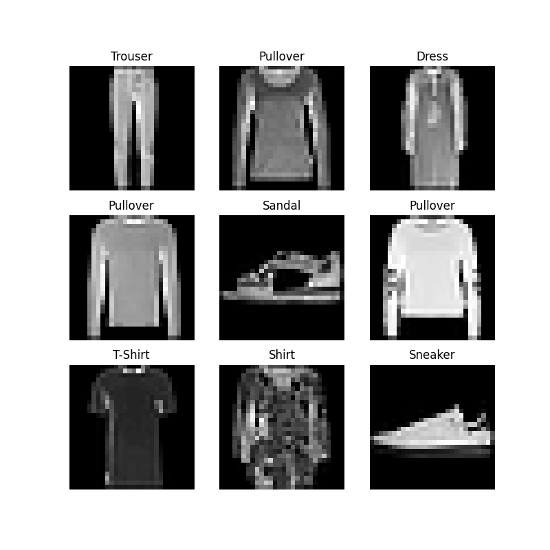
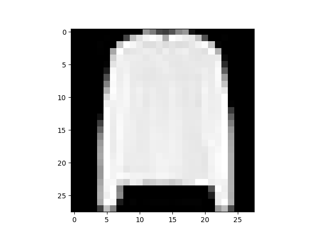

# 数据加载和处理

PyTorch 提供了两个数据基元：`torch.utils.data.DataLoader` 和 `torch.utils.data.Dataset`，它们允许你使用预加载的数据集和你自己的数据。`Dataset` 存储示例及其对应的标签，`DataLoader` 围绕 `Dataset` 包装了一个可迭代对象，以方便访问示例。

PyTorch 域库提供了许多预加载的数据集（如 [FashionMNIST](https://pytorch.org/vision/stable/datasets.html#fashion-mnist) ），它们子类化了 `torch.utilS.data.Dataset` 并实现了针对特定数据的函数。它们可以用来建立模型的原型和基准。详见：[图像数据集](https://pytorch.org/vision/stable/datasets.html)，[文本数据集](https://pytorch.org/text/stable/datasets.html)和[音频数据集](https://pytorch.org/audio/stable/datasets.html)

## 1 [加载数据集](https://pytorch.org/tutorials/beginner/basics/data_tutorial.html#loading-a-dataset)

以从 TorchVision 中加载 Fashion-MNIST数据集为例。Fashion-MNIST 是Zalando 文章图像的数据集，包含 60,000 个训练示例和 10,000 个测试示例。每个示例包括 28×28 灰度图像和来自 10 个类中的一个的关联标签。

参数说明：

* `root`：训练集 / 测试集数据存储路径；

* `train`：指定训练或测试数据集；

* `download=True`：从网上下载数据如其在 `root` 上不可用；

* `transform` 和 `target_transform`：指定特性和标签转换。

```Python
import torch
from torch.utils.data import Dataset
from torchvision import datasets
from torchvision.transforms import ToTensor
import matplotlib.pyplot as plt


training_data = datasets.FashionMNIST(
	root="data",
	train=True,
	download=True,
	transform=ToTensor()
)

test_data = datasets.FashionMNIST(
	root="data",
	train=False,
	download=True,
	transform=ToTensor()
)
```

输出：

```
Downloading http://fashion-mnist.s3-website.eu-central-1.amazonaws.com/train-images-idx3-ubyte.gz
Downloading http://fashion-mnist.s3-website.eu-central-1.amazonaws.com/train-images-idx3-ubyte.gz to data/FashionMNIST/raw/train-images-idx3-ubyte.gz
Extracting data/FashionMNIST/raw/train-images-idx3-ubyte.gz to data/FashionMNIST/raw

Downloading http://fashion-mnist.s3-website.eu-central-1.amazonaws.com/train-labels-idx1-ubyte.gz
Downloading http://fashion-mnist.s3-website.eu-central-1.amazonaws.com/train-labels-idx1-ubyte.gz to data/FashionMNIST/raw/train-labels-idx1-ubyte.gz
Extracting data/FashionMNIST/raw/train-labels-idx1-ubyte.gz to data/FashionMNIST/raw

Downloading http://fashion-mnist.s3-website.eu-central-1.amazonaws.com/t10k-images-idx3-ubyte.gz
Downloading http://fashion-mnist.s3-website.eu-central-1.amazonaws.com/t10k-images-idx3-ubyte.gz to data/FashionMNIST/raw/t10k-images-idx3-ubyte.gz
Extracting data/FashionMNIST/raw/t10k-images-idx3-ubyte.gz to data/FashionMNIST/raw

Downloading http://fashion-mnist.s3-website.eu-central-1.amazonaws.com/t10k-labels-idx1-ubyte.gz
Downloading http://fashion-mnist.s3-website.eu-central-1.amazonaws.com/t10k-labels-idx1-ubyte.gz to data/FashionMNIST/raw/t10k-labels-idx1-ubyte.gz
Extracting data/FashionMNIST/raw/t10k-labels-idx1-ubyte.gz to data/FashionMNIST/raw
```

## 2 [迭代及可视化数据集](https://pytorch.org/tutorials/beginner/basics/data_tutorial.html#iterating-and-visualizing-the-dataset)

我们可以像列表一样手动索引 `Datasets`：`training_data[index]`。使用 `matplotlib` 来可视化训练数据中的一些示例。

```Python
labels_map = {
	0: "T-Shirt",
	1: "Trouser",
	2: "Pullover",
	3: "Dress",
	4: "Coat",
	5: "Sandal",
	6: "Shirt",
	7: "Sneaker",
	8: "Bag",
	9: "Ankle Boot",
}
figure = plt.figure(figsize=(8, 8))
cols, rows = 3, 3
for i in range(1, cols * rows + 1):
	sample_idx = torch.randint(len(training_data), size=(1,)).item()
	img, label = training_data[sample_idx]
	figure.add_subplot(rows, cols, i)
	plt.title(labels_map[label])
	plt.axis("off")
	plt.imshow(img.squeeze(), cmap="gray")
plt.show()
```



___

## 3 [为文件创建自定义数据集](https://pytorch.org/tutorials/beginner/basics/data_tutorial.html#creating-a-custom-dataset-for-your-files)

### 3.1 创建数据集

自定义 Dataset 类必须实现三个函数：`__init__`、`__len__` 和 `__getitem__`。以下文实现为例，FashionMNIST 映像存储在目录 `img_dir` 中，它们的标签分别存储在 CSV 文件 `annotations_file` 中。

```Python
import os
import pandas as pd
from torchvision.io import read_image

class CustomImageDataset(Dataset):
	def __init__(self, annotations_file, img_dir, transform=None, target_transform=None):
		self.img_labels = pd.read_csv(annotations_file)
		self.img_dir = img_dir
		self.transform = transform
		self.target_transform = target_transform

    def __len__(self):
		return len(self.img_labels)

    def __getitem__(self, idx):
		img_path = os.path.join(self.img_dir, self.img_labels.iloc[idx, 0])
		image = read_image(img_path)
		label = self.img_labels.iloc[idx, 1]
		if self.transform:
			image = self.transform(image)
		if self.target_transform:
			label = self.target_transform(label)
		return image, label
```

### 3.2 函数详解

#### 3.2.1 `__init__`

`__init__` 函数在实例化 Dataset 对象时运行一次。我们初始化包含图像、注释文件和这两种转换的目录(下一节将详细介绍)。

`labels.csv` 文件形如：

```
tshirt1.jpg, 0
tshirt2.jpg, 0
......
ankleboot999.jpg, 9
```

```Python
def __init__(self, annotations_file, img_dir, transform=None, target_transform=None):
	self.img_labels = pd.read_csv(annotations_file)
	self.img_dir = img_dir
	self.transform = transform
	self.target_transform = target_transform
```

#### 3.2.2 `__len__`

`__len__` 函数返回数据集中实例的数量。

例：

```Python
def __len__(self):
	return len(self.img_labels)
```

#### 3.2.3 `__getitem__`

`__getitem__` 函数从给定的索引 `idx` 处的数据集加载并返回一个实例。基于此索引，识别图像在磁盘上的位置，并使用 `read_image` 将其转换为张量，从 `self.img_labels` 中的 csv 数据中检索相应的标签，对它们调用变换函数（如果适用），并在元组中返回张量图像和对应的标签。

```Python
def __getitem__(self, idx):
	img_path = os.path.join(self.img_dir, self.img_labels.iloc[idx, 0])
	image = read_image(img_path)
	label = self.img_labels.iloc[idx, 1]
	if self.transform:
		image = self.transform(image)
	if self.target_transform:
		label = self.target_transform(label)
	return image, label
```

## 3 [用 DataLoaders 为训练准备数据](https://pytorch.org/tutorials/beginner/basics/data_tutorial.html#preparing-your-data-for-training-with-dataloaders)

`Dataset` 每次检索数据集中一个样本的特性和标签。在训练模型时，我们通常希望以“小批量”通过样本，在每个时期重新洗牌数据以减少模型过拟合，并使用 Python 的 `multiprocessing` 来加快数据检索。

`DataLoader` 是一个可迭代对象，它在一个简单的 API 中为我们抽象了这种复杂性。

```Python
from torch.utils.data import DataLoader

train_dataloader = DataLoader(training_data, batch_size=64, shuffle=True)
test_dataloader = DataLoader(test_data, batch_size=64, shuffle=True)
```

## 4 [迭代 DataLoader](https://pytorch.org/tutorials/beginner/basics/data_tutorial.html#iterate-through-the-dataloader)

我们已经将数据集加载到 DataLoader 中，并可以根据需要遍历数据集。下面的每个迭代都返回一批 `train_features` 和 `train_labels`（分别包含 `batch_size=64` 个特性和标签）。因为我们指定了 `shuffle=True`，所以在遍历所有批次之后，数据将被打乱（为了更细粒度地控制数据加载顺序，请查看 [Samplers](https://pytorch.org/docs/stable/data.html#data-loading-order-and-sampler)）。

```Python
# Display image and label.
train_features, train_labels = next(iter(train_dataloader))
print(f"Feature batch shape: {train_features.size()}")
print(f"Labels batch shape: {train_labels.size()}")
img = train_features[0].squeeze()
label = train_labels[0]
plt.imshow(img, cmap="gray")
plt.show()
print(f"Label: {label}")
```



输出：

```
Feature batch shape: torch.Size([64, 1, 28, 28])
Labels batch shape: torch.Size([64])
Label: 6
```

## 5 进一步了解

详见 [torch.utils.data API](https://pytorch.org/docs/stable/data.html)

___

转载自：  
[DATASETS & DATALOADERS](https://pytorch.org/tutorials/beginner/basics/data_tutorial.html)