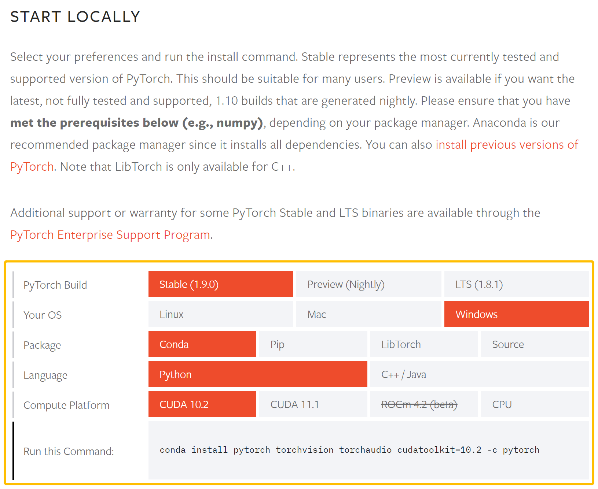
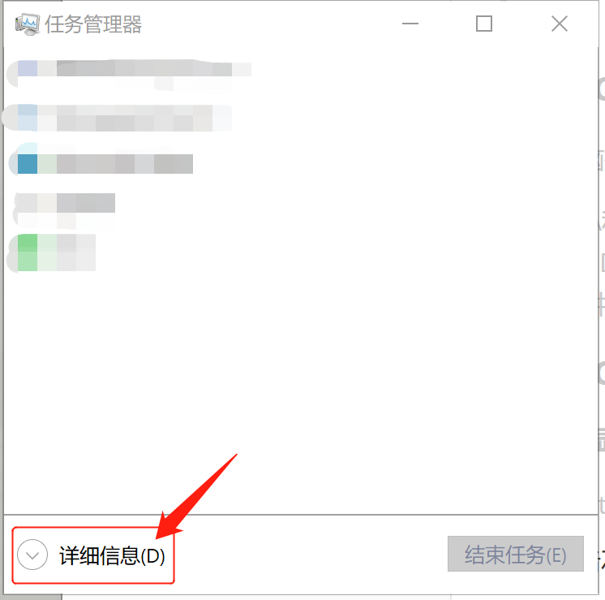
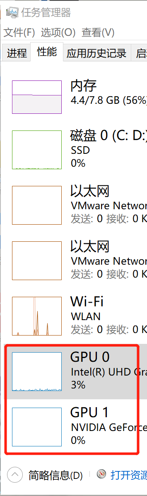
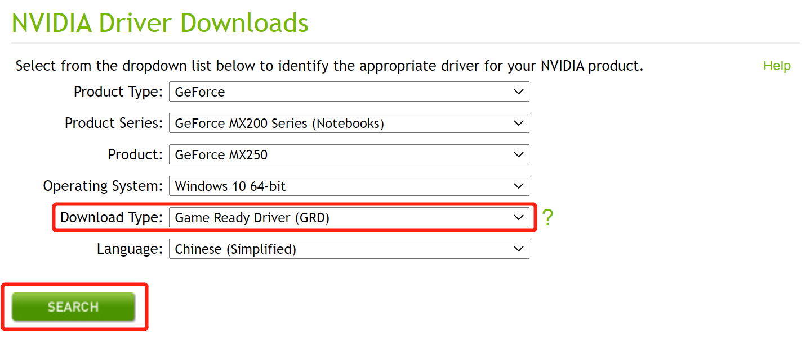
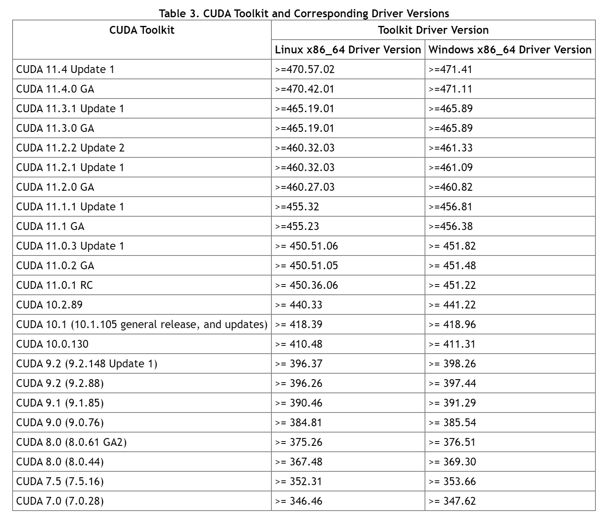

# 安装PyTorch


\*说明：本文中网站部分为境外网站，可能不稳定，如遇网站打不开的情况可等待一段时间再刷新。


## 1 安装最新版 PyTorch

关于安装 PyTorch，[官网](https://pytorch.org/get-started/locally/)上有方便且详细的安装说明。

在 **START LOCALLY** 部分选择合适的 PyTorch 版本、系统类型、安装包、编程语言、计算平台，并运行 **Run this Command** 中的命令即可完成安装。



上图中 **Compute Platform** 部分代表运算平台，可自行选择是否使用 CUDA （或 ROCm )。如使用 CUDA 则需先下载好相应版本的 CUDA 再安装 PyTorch 。

下面详细说明 CUDA 的选择和下载。

### 1.1 CUDA 是什么

CUDA（Compute Unified Device Architecture），是显卡厂商 NVIDIA 推出的运算平台，主要用于**支持 GPU 加速计算**。

\*一般而言，GPU 会比 CPU 有 5 ~ 10 倍的加速，因此如果有合适的显卡，安装 CUDA 比较好。

\*如果电脑不支持 CUDA，只是无法使用显卡加速，并无其他影响。

### 1.2 使用 CUDA 的条件

需要电脑有 NVIDIA 的显卡

\*CUDA 和后文中的 ROCm 都是显卡的驱动程序，区别在于 CUDA 是 NVIDIA 的，ROCm 是 AMD 的，选择哪一个驱动程序取决于电脑硬件。

### 1.3 查看 CUDA 版本并安装

#### 1.3.1 查看显卡型号

1. 按 Alt \+ Ctrl \+ Del 打开任务管理器

2. 点击左下角 “详细信息”

	

3. 点击上方 “性能” 栏

	

4. 找到 GPU（如果是双显卡，则还会有 GPU1），记住 GPU 型号

	

#### 1.3.2 查看对应 CUDA 版本并安装

1. 打开 [NVIDIA 网站](https://www.nvidia.com/Download/index.aspx?lang=en-us)

2. 填写显卡型号等信息，点击 **SEARCH** 查询

	\*Download Type 一般选择 Game Ready Driver 即可  
	\*Studio 版用于专业视频处理软件加速

	

3. 记住 NVIDIA 驱动版本并安装相应驱动

	

	

4. 打开[此网站](https://docs.nvidia.com/cuda/cuda-toolkit-release-notes/index.html)，找到 **Table 3.CUDA Toolkit and Corresponding Driver Versions**，即为需要安装的 CUDA 版本

	

5. 打开 [CUDA 下载网站](https://developer.nvidia.com/cuda-toolkit-archive)，下载对应版本的 CUDA


## \*2 安装 1.9.0 版 PyTorch

### 2.1 Windows 系统

可以自行选择通过 pip 或 Anaconda 来安装。

\*以下 Windows 发行版本支持 PyTorch：

* Windows 7 及以上版本，推荐使用 Windows 10及以上版本

* Windows Sever 2008 r2 或以上版本

\*此安装说明通常适用于所有受支持的 Windows 发行版

\*文中所显示的具体示例在 Windows 10 上运行

\*要求 Python 3.x 版本

\*为了充分利用 PyTorch 的 CUDA 支持，建议 Windows 系统使用 NVIDIA GPU，但不是必需的

#### 2.1.1 通过 pip 安装

***常见错误：MemoryError**

错误原因：由于 pip 的缓存机制尝试将待安装库的整个文件缓存到内存，而在限制缓存大小的环境中如果安装包较大就会出现 MemoryError 的这个错误。

解决方法：将 `pip3 install torch` 命令改为 `pip3 --no-cache-dir install torch` ，以此禁用缓存。

##### 2.1.1.1 使用 CUDA

根据需要的 CUDA 版本，在 cmd 中运行以下两种命令之一。一般来讲，最新的 CUDA 版本更好。

CUDA 11.1

```bash
pip3 install torch==1.9.0+cu111 torchvision==0.10.0+cu111 torchaudio===0.9.0 -f https://download.pytorch.org/whl/torch_stable.html
```

CUDA 10.2

```bash
pip3 install torch==1.9.0+cu102 torchvision==0.10.0+cu102 torchaudio===0.9.0 -f https://download.pytorch.org/whl/torch_stable.html
```

##### 2.1.1.2 不使用 CUDA

电脑不支持 CUDA 或不需要 CUDA 可选择此方法。在 cmd 中运行以下代码。

```bash
pip3 install torch torchvision torchaudio
```

#### 2.1.2 通过 Anaconda 安装

要使用 Anaconda 安装 PyTorch，需要通过 `Start | Anaconda3 | Anaconda prompt` 打开一个 Anaconda 提示符

##### 2.1.2.1 使用 CUDA

根据需要的 CUDA 版本，运行以下两种命令之一。一般来讲，最新的 CUDA 版本更好。

CUDA 11.1

```bash
conda install pytorch torchvision torchaudio cudatoolkit=11.1 -c pytorch -c conda-forge
```

***注意：** cudatoolkit 11.1 需要 'conda-forge' 通道

CUDA 10.2

```bash
conda install pytorch torchvision torchaudio cudatoolkit=10.2 -c pytorch
```

##### 2.1.2.2 不使用 CUDA

电脑不支持 CUDA 或不需要 CUDA 可选择此方法。运行以下命令。

```bash
conda install pytorch torchvision torchaudio cpuonly -c pytorch
```

### 2.2 Mac 系统

可以自行选择通过 pip 或 Anaconda 安装

\*macOS 10.10 (Yosemite) 或更高版本支持 PyTorch

\*要求 Python 3.5 及以上版本

\*为充分利用 PyTorch 的 CUDA 支持，建议 Mac 使用 NVIDIA 的 GPU，但不是必需的

\*目前，macOS 上的 CUDA 支持只能通过从源代码构建 PyTorch 来获得

#### 2.2.1 通过 pip 安装

使用以下命令

```bash
pip3 install torch torchvision
```

***常见错误：MemoryError**

错误原因：由于 pip 的缓存机制尝试将待安装库的整个文件缓存到内存，而在限制缓存大小的环境中如果安装包较大就会出现 MemoryError 的这个错误。

解决方法：将 `pip3 install torch` 命令改为 `pip3 --no-cache-dir install torch` ，以此禁用缓存。

#### 2.2.2 通过 Anaconda 安装

使用以下命令

```bash
conda install pytorch torchvision -c pytorch
```

### 2.3 Linux 系统

可以自行选择通过 pip 或 Anaconda 安装

\*PyTorch 在使用 glibc \>= v2.17 的 Linux 发行版上受支持，包括:

- [Arch Linux](https://www.archlinux.org/download/), 最低版本 2012-07-15

- [CentOS](https://www.centos.org/download/), 最低版本 7.3-1611

- [Debian](https://www.debian.org/distrib/), 最低版本 8.0

- [Fedora](https://getfedora.org/), 最低版本 24

- [Mint](https://linuxmint.com/download.php), 最低版本 14

- [OpenSUSE](https://software.opensuse.org/), 最低版本 42.1

- [PCLinuxOS](https://www.pclinuxos.com/get-pclinuxos/), 最低版本 2014.7

- [Slackware](http://www.slackware.com/getslack/), 最低版本 14.2

- [Ubuntu](https://www.ubuntu.com/download/desktop), 最低版本 13.04

\*此说明通常适用于所有受支持的 Linux 发行版；不同的是，你的发行版可能支持 yum 而不是 apt；文中的具体示例是在 Ubuntu 18.04 机器上运行的

\*要求 Python 3.6 及以上

\*为了充分利用 PyTorch 的 CUDA 支持，建议 Linux 系统有 NVIDIA GPU，但不是必需的

#### 2.3.1 通过 pip 安装

***常见错误：MemoryError**

错误原因：由于 pip 的缓存机制尝试将待安装库的整个文件缓存到内存，而在限制缓存大小的环境中如果安装包较大就会出现 MemoryError 的这个错误。

解决方法：将 `pip3 install torch` 命令改为 `pip3 --no-cache-dir install torch` ，以此禁用缓存。

##### 2.3.1.1 使用 CUDA

根据需要的 CUDA 版本，运行以下两种命令之一。一般来讲，最新的 CUDA 版本更好。

CUDA 11.1

```bash
pip3 install torch==1.9.0+cu111 torchvision==0.10.0+cu111 torchaudio==0.9.0 -f https://download.pytorch.org/whl/torch_stable.html
```

CUDA 10.2

```bash
pip3 install torch torchvision torchaudio
```

##### 2.3.1.2 使用 ROCm 4.2 (beta)

电脑支持 ROCm 可选择此方法。运行以下命令。

```bash
pip3 install torch -f https://download.pytorch.org/whl/rocm4.2/torch_stable.html
pip3 install ninja && pip3 install 'git+https://github.com/pytorch/vision.git@v0.10.0'
```

##### 2.3.1.3 不使用 CUDA 或 ROCm

电脑不支持 CUDA (ROCm) 或不需要 CUDA (ROCm) 可选择此方法。运行以下命令。

```bash
pip3 install torch==1.9.0+cpu torchvision==0.10.0+cpu torchaudio==0.9.0 -f https://download.pytorch.org/whl/torch_stable.html
```

#### 2.3.2 通过 Anaconda 安装

##### 2.3.2.1 使用 CUDA

根据需要的 CUDA 版本，运行以下两种命令之一。一般来讲，最新的 CUDA 版本更好。

CUDA 11.1

**注意：**cudatoolkit 11.1 需要 'nvidia' 通道

```bash
conda install pytorch torchvision torchaudio cudatoolkit=11.1 -c pytorch -c nvidia
```

CUDA 10.2

```bash
conda install pytorch torchvision torchaudio cudatoolkit=10.2 -c pytorch
```

##### 2.3.2.2 不使用 CUDA

电脑不支持 CUDA 或不需要 CUDA 可选择此方法。运行以下命令。

```bash
conda install pytorch torchvision torchaudio cpuonly -c pytorch
```


## 3 验证是否安装成功

### 3.1 PyTorch

为了确保 PyTorch 已正确安装，我们可以通过在 Python 中运行样例 PyTorch 代码来验证安装。这里我们将构造一个随机初始化的张量。

```python
import torch
x = torch.rand(5, 3)
print(x)
```

如安装成功，则输出类似：

```
tensor([[0.2909, 0.1746, 0.5248],
		[0.6025, 0.7822, 0.0810],
		[0.4011, 0.6752, 0.7671],
		[0.1711, 0.3247, 0.7620],
		[0.1548, 0.5274, 0.9023]])
```

### 3.２ 检查 GPU 驱动程序和 CUDA 是否启用并可通过 PyTorch 访问

运行以下代码：

```python
import torch
torch.cuda.is_available()
```

将返回是否启用 CUDA 驱动程序
