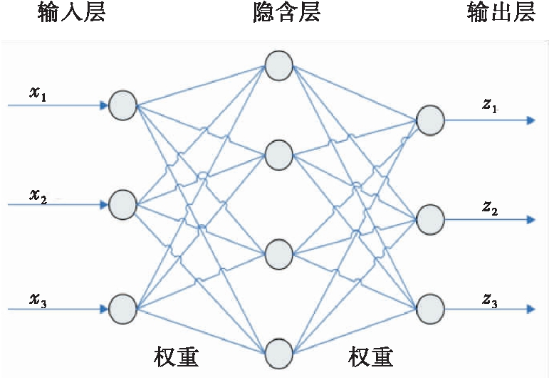
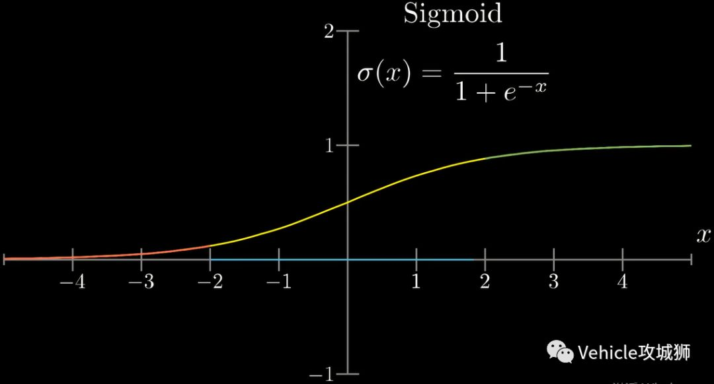
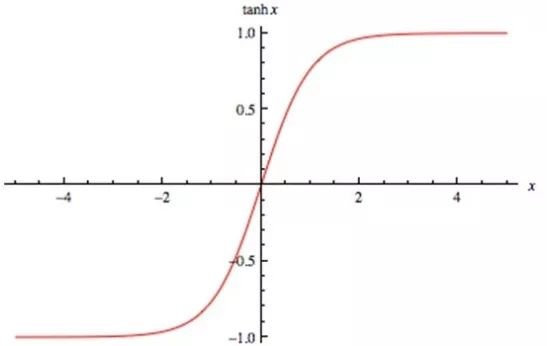
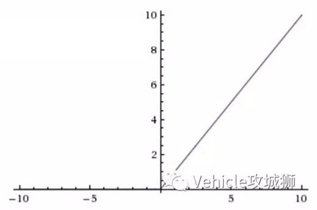

# 向量数据建模：MLP

\*注：本文是对参考文章的翻译、整理，更详细深入的信息详见文末参考文章。

## 1 概述

### 1.1 什么是 MLP

**多层感知机**（MLP, Multi-Layer Perceptron）也叫**人工神经网络**（ANN, Artifical Neural Network），简称**神经网络**（neural network，NN），是一种模仿生物神经网络的结构和功能的数学模型或计算模型。

网络自身通常是对自然界某种算法或者函数的逼近，也可能是对一种逻辑策略的表达。

### 1.2 MLP 的构成

多层感知机由大量**节点**（或称“神经元”）和之间相互的**联接**构成，可以看作由其他模块(层)组成，包括**输入层**、**隐层**和**输出层**。最简单的 MLP 只含一个隐层，结构图如下。



从上图可以看到，多层感知机层与层之间是全连接的，上一层的任何一个神经元与下一层的所有神经元都有连接。

MLP 有三个基本要素：**权重**（也叫**连接系数**）、**偏置**和**激励函数**（或称“激活函数”）（activation function）。

* 权重：神经元之间的连接强度由权重表示，权重的大小表示可能性的大小。

* 偏置：偏置的设置是为了正确分类样本，是模型中一个重要的参数，即保证通过输入算出的输出值不能随便激活。

* 激励函数：起非线性映射的作用，其可将神经元的输出幅度限制在一定范围内，一般限制在 $(-1, 1)$ 或 $(0, 1)$ 之间。常用的激活函数有：

	* $\mathrm{Sigmoid}$ 函数，可将 $(-\infty, +\infty)$ 的数映射到 $(0, 1)$ 的范围内。公式为：$\sigma(x) = \frac 1{1 + e^{-x}}$

		

	* $\mathrm{tanh}$ 函数，均值为0，在实际应用中有比 $\mathrm{Sigmoid}$ 函数更好的效果。公式为：$\mathrm{tanh}(x) = \frac {e^x - e^{-x}}{e^x + e^{-x}}$

		

	* $\mathrm{ReLU}$ 函数，当输入信号小于 0 时，输出为 0；当输入信号大于 0 时，输出等于输入。

		

网络的输出由网络的连接方式、权重值和激励函数决定。大多数情况下人工神经网络能在外界信息的基础上改变内部结构，是一种自适应系统。

用向量 $X$ 表示输入层，则隐藏层的输出为 $X_1 = \phi(W_1X + b_1)$，$W_1$ 是权重，$b_1$ 是偏置，函数 $\phi()$ 为激励函数。

隐藏层到输出层可以看成是一个多类别的逻辑回归，也即 $\mathrm{softmax}$ 回归，所以输出层的输出就是 $X_2 = \mathrm{softmax}(W_2X_1 + b_2)$。

上述三层 MLP 用公式总结起来即为：

$$
f(x) = \mathrm{softmax}(b_2 + W_2(\sigma(b_1 + W_1x)))
$$

### 1.3 神经网络的用途

现代神经网络是一种非线性统计性数据建模工具，常用来对输入和输出间复杂的关系进行建模，或用来探索数据的模式。

神经网络也是数学统计学方法的一种实际应用，通过统计学的标准数学方法，一方面我们能够得到大量的可以用函数来表达的局部结构空间，另一方面在人工智能学的人工感知领域，人工神经网络能够类似人一样具有简单的决定能力和简单的判断能力，这种方法比起正式的逻辑学推理演算更具有优势。

## 2 构建神经网络

`torch.nn` 提供了构建自己的神经网络所需的所有构建块。PyTorch 中的每个模块都继承了 `nn.Module`。

下面将构建一个神经网络来对 `FashionMNIST` 数据集里的图像进行分类。

### 2.1 导入必要的 Python 模块

```Python
import os
import torch
from torch import nn
from torch.utils.data import DataLoader
from torchvision import datasets, transforms
```

### 2.2 获取硬件加速

检查 `torch.cuda` 是否可用，若可用则使用 GPU 加速，否则继续使用 CPU。

```Python
device = 'cuda' if torch.cuda.is_available() else 'cpu'
print('Using {} device'.format(device))
```

### 2.3 定义类

#### 2.3.1 子集化 `nn.Module`

通过子集化 `nn.Module` 定义神经网络，并在 `__init__` 中初始化神经网络层。每一个 `nn.Module` 的子类都实现了对输入数据的前向操作。

```Python
class NeuralNetwork(nn.Module):
	def __init__(self):
		super(NeuralNetwork, self).__init__()
		self.flatten = nn.Flatten()
		self.linear_relu_stack = nn.Sequential(
			nn.Linear(28*28, 512),
			nn.ReLU(),
			nn.Linear(512, 512),
			nn.ReLU(),
			nn.Linear(512, 10),
		)
		
	def forward(self, x):
		x = self.flatten(x)
		logits = self.linear_relu_stack(x)
		return logits
```

#### 2.3.2 实例

##### 2.3.2.1 创建实例

创建一个 `NeuralNetwork` 的实例，将其移动到 `device`，然后打印它的结构。

```Python
model = NeuralNetwork().to(device)
print(model)
```

输出：

```
NeuralNetwork(
  (flatten): Flatten(start_dim=1, end_dim=-1)
  (linear_relu_stack): Sequential(
    (0): Linear(in_features=784, out_features=512, bias=True)
    (1): ReLU()
    (2): Linear(in_features=512, out_features=512, bias=True)
    (3): ReLU()
    (4): Linear(in_features=512, out_features=10, bias=True)
  )
)
```

使用时，先将输入数据传递给模型，模型将执行 `forward` 和一些后台操作。

**\*注意：不要直接调用 `model.forward()`！**

##### 2.3.2.2 获取预测概率

在输入上调用模型将返回一个带有每个类的原始预测值的 10 维张量。我们通过 `nn.Softmax` 模型的一个实例来获取预测概率。

```Python
X = torch.rand(1, 28, 28, device=device)
logits = model(X)
pred_probab = nn.Softmax(dim=1)(logits)
y_pred = pred_probab.argmax(1)
print(f"Predicted class: {y_pred})
```

输出：

```
Predicted class: tensor([6], device='cuda:0')
```

___

### 2.4 模型层

下面分解 `FashionMINST` 模型中的各个层。

取 3 张大小为 28×28 的小批量（ [minibatch](https://blog.csdn.net/CAUC_learner/article/details/105818405) ）图像样本，看看它们通过网络时会发生什么。

```Python
imput_image = torch.rand(3,28,28)
print(input_image.size())
```

输出：

```
torch.Size([3, 28, 28])
```

#### 2.4.1 `nn.Flatten`

为将每个 2D 28×28 图像转换为 784 像素值的连续数组（在 dim=0 处保持了小批量维度），初始化 `nn.Flatten` 层。

```Python
flatten = nn.Flatten()
flat_image = flatten(input_image)
print(flat_image.size())
```

输出：

```
torch.Size([3, 784])
```

#### 2.4.2 `nn.Linear`

线性层是一个模块，使用它已存储的权值和偏差对输入进行线性变换。

```Python
layer1 = nn.Linear(in_features=28*28, out_features=20)
hidden1 = layer1(flat_image)
print(hidden1.size())
```

输出：

```
torch.Size([3, 20])
```

#### 2.4.3 `nn.ReLU`

非线性激活函数会在模型的输入和输出之间创建复杂的映射。在线性变换后应用它们以引入*非线性特征*，帮助神经网络学习各种各样的现象。

在这个模型中，我们在线性层之间使用 `nn.ReLU`，但模型中还有其它用来引入非线性特征的激活函数。

```Python
print(f"Before ReLU: {hidden1}\n\n")
hidden1 = nn.ReLU()(hidden1)
print(f"After ReLU: {hidden1}")
```

输出：

```
Before ReLU: tensor([[-0.1374, -0.1275, -0.1763, -0.1598,  0.1575,  0.2056,  0.1269, -0.3672,
		  0.0818,  0.0090,  0.2284, -0.1338, -0.2520, -0.0284,  0.1861,  0.4137,
		  0.2944, -0.5756,  0.1181, -0.8041],
		[-0.0937,  0.1559, -0.3381,  0.4650,  0.4422, -0.0971,  0.0494, -0.1400,
		  0.2328, -0.1273,  0.1655,  0.2052, -0.2785, -0.1622,  0.2160,  0.2634,
		 -0.1564, -0.7125, -0.0639, -0.7394],
		[-0.2310,  0.1779, -0.1173,  0.4294,  0.0031,  0.1889,  0.2607,  0.2186,
		  0.1280, -0.0885,  0.1855, -0.1325, -0.0105, -0.2737, -0.1220,  0.0780,
		  0.1856, -0.6755,  0.0491, -0.9393]], grad_fn=<AddmmBackward>)


After ReLU: tensor([[0.0000, 0.0000, 0.0000, 0.0000, 0.1575, 0.2056, 0.1269, 0.0000, 0.0818,
		 0.0090, 0.2284, 0.0000, 0.0000, 0.0000, 0.1861, 0.4137, 0.2944, 0.0000,
		 0.1181, 0.0000],
		[0.0000, 0.1559, 0.0000, 0.4650, 0.4422, 0.0000, 0.0494, 0.0000, 0.2328,
		 0.0000, 0.1655, 0.2052, 0.0000, 0.0000, 0.2160, 0.2634, 0.0000, 0.0000,
		 0.0000, 0.0000],
		[0.0000, 0.1779, 0.0000, 0.4294, 0.0031, 0.1889, 0.2607, 0.2186, 0.1280,
		 0.0000, 0.1855, 0.0000, 0.0000, 0.0000, 0.0000, 0.0780, 0.1856, 0.0000,
		 0.0491, 0.0000]], grad_fn=<ReluBackward0>)
```

#### 2.4.4 `nn.Sequential`

`nn.Sequential` 是一个有序的模块容器。数据按照定义的顺序在所有模块中传递。顺序容器可以用来组合一个快速网络，如 `seq_modules`。

```Python
seq_modules = nn.Sequential(
	flatten,
	layer1,
	nn.ReLU(),
	nn.Linear(20,10)
)
input_image = torch.rand(3,28,28)
logits = seq_modules(input_image)
```

#### 2.4.5 `nn.Softmax`

神经网络的最后一个线性层返回 **logits**，即 [-infty, infty] 中的原始值。这些值被传递给 `nn.Softmax` 模块。**logits** 被缩放为 [0, 1] 之间的值，代表模型对每个类的预测概率。 `dim` 参数指出数值总和必须为 1 的维度。

```Python
softmax = nn.Softmax(dim=1)
pred_probab = softmax(logits)
```

#### 2.4.6 模型参数

神经网络中的许多层都是**参数化的**，也就是说，在训练过程中会优化相关的权值和偏差。子类化 `nn.Module` 自动跟踪模型对象中定义的所有字段，并使用模型的 `parameters()` 或 `named_parameters()` 方法访问所有参数。

在本例中，我们遍历每个参数，并打印其大小和值的预览。

```Python
print("Model structure: ", model, "\n\n")

for name, param in model.named_parameters():
	print(f"Layer: {name} | Size: {param.size()} | Values : {param[:2]} \n")
```

输出：

```
Model structure:  NeuralNetwork(
  (flatten): Flatten(start_dim=1, end_dim=-1)
  (linear_relu_stack): Sequential(
	(0): Linear(in_features=784, out_features=512, bias=True)
	(1): ReLU()
	(2): Linear(in_features=512, out_features=512, bias=True)
	(3): ReLU()
	(4): Linear(in_features=512, out_features=10, bias=True)
  )
)


Layer: linear_relu_stack.0.weight | Size: torch.Size([512, 784]) | Values : tensor([[-0.0195, -0.0221,  0.0074,  ..., -0.0245, -0.0008,  0.0105],
		[-0.0329, -0.0321,  0.0010,  ...,  0.0318,  0.0074,  0.0024]],
	   device='cuda:0', grad_fn=<SliceBackward>)

Layer: linear_relu_stack.0.bias | Size: torch.Size([512]) | Values : tensor([-0.0072,  0.0141], device='cuda:0', grad_fn=<SliceBackward>)

Layer: linear_relu_stack.2.weight | Size: torch.Size([512, 512]) | Values : tensor([[-0.0100,  0.0118, -0.0172,  ..., -0.0102, -0.0317,  0.0013],
		[-0.0282, -0.0203,  0.0397,  ..., -0.0313, -0.0387, -0.0259]],
	   device='cuda:0', grad_fn=<SliceBackward>)

Layer: linear_relu_stack.2.bias | Size: torch.Size([512]) | Values : tensor([ 0.0369, -0.0018], device='cuda:0', grad_fn=<SliceBackward>)

Layer: linear_relu_stack.4.weight | Size: torch.Size([10, 512]) | Values : tensor([[ 0.0041,  0.0212, -0.0339,  ...,  0.0407, -0.0079,  0.0098],
		[-0.0042, -0.0204, -0.0111,  ...,  0.0171,  0.0042, -0.0271]],
	   device='cuda:0', grad_fn=<SliceBackward>)

Layer: linear_relu_stack.4.bias | Size: torch.Size([10]) | Values : tensor([-0.0431,  0.0147], device='cuda:0', grad_fn=<SliceBackward>)
```

___

### 2.5 进一步阅读

详见 [torch.nn API](https://pytorch.org/docs/stable/nn.html)

## 3 保存和加载模型

在本节中，我们将了解如何通过保存、加载和运行模型预测来持久化模型状态。

### 3.1 导入必要 Python 模块

```Python
import torch
import torch.onnx as onnx
import torchvision.models as models
```

### 3.2 保存和加载模型权重

PyTorch 模型将学习到的参数存储在一个内部状态字典中，称为 `state_dict`。这些都可以通过 `torch.save` 来延续。保存方法：

```Python
model = models.vgg16(pretrained=True)
torch.save(model.state_dict(), 'model_weights.pth')
```

要加载模型权重，首先需要创建相同模型的实例，然后使用 `load_state_dict()` 方法加载参数。

```Python
model = models.vgg16() # we do not specify pretrained=True, i.e. do not load default weights
model.load_state_dict(torch.load('model_weights.pth'))
model.eval()
```

**\*注意：一定要在推断之前调用 `model.eval()` 方法，将退出和批处理规范化层设置为评估模式。如果不这样做，将产生不一致的推断结果。**

### 3.3 用形状保存和加载模型

当加载模型权重时，我们需要首先实例化模型类，因为类定义了网络的结构。我们可能想要将这个类的结构和模型一起保存，在这种情况下，我们可以将 `model`（而不是 `model.state_dict()`）传递给保存函数：

```Python
torch.save(model, 'model.pth')
```

然后我们可以像这样加载模型:

```Python
model = torch.load('model.pth')
```

**\*注意：这种方法在序列化模型时使用 Python pickle 模块，因此它依赖于加载模型时可用的实际类定义。**

### 3.3 导出模型到 ONNX

PyTorch 也有本地 ONNX 导出支持。但是，由于 PyTorch 执行图的动态特性，导出过程必须遍历执行图以生成持久的 ONNX 模型。出于这个原因，应该向导出例程传递一个大小合适的测试变量（在本例中，我们将创建一个大小正确的虚拟零张量）：

```Python
input_image = torch.zeros((1,3,224,224))
onnx.export(model, input_image, 'model.onnx')
```

使用 ONNX 模型可以做很多事情，包括在不同的平台和不同的编程语言上运行推断。更多细节请访问 ONNX 教程。

___

参考文章：  
[一文搞懂 RNN （循环神经网络）基础篇（知乎）](https://zhuanlan.zhihu.com/p/30844905)  
[DeepLearning tutorial（3）MLP 多层感知机原理简介 + 代码详解](https://blog.csdn.net/u012162613/article/details/43221829)  
[神经网络：多层感知器-MLP](https://www.chinait.com/ai/30661.html)  
[神经网络详解（CSDN）](https://blog.csdn.net/as091313/article/details/79080583)  
[BUILD THE NEURAL NETWORK](https://pytorch.org/tutorials/beginner/basics/buildmodel_tutorial.html)  
[SAVE AND LOAD THE MODEL](https://pytorch.org/tutorials/beginner/basics/saveloadrun_tutorial.html)