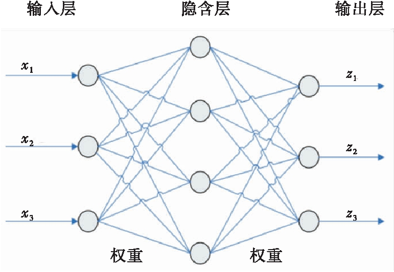
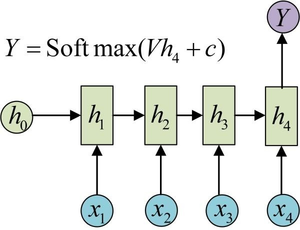

# 序列数据建模：RNN

## 1 什么是 RNN

RNN（Recurrent Neural Network）即**循环神经网络**，是一类用于处理序列数据的神经网络。

### 1.1 序列数据

总得来讲，序列数据有一个特点——**后面的数据与前面的数据有关系**

其中，时间序列数据是指在不同时间点上收集到的数据，这类数据反映了某一事物、现象等随时间的变化状态或程度。

### 1.2 神经网络

神经网络可以当做是能够拟合任意函数的黑盒子，只要训练数据足够，给定特定的 x，就能得到希望的 y。

神经网络的结构包括：**输入层**、**隐层**和**输出层**，通过激活函数控制输出，层与层之间通过权值连接，结构图如下。



## 2 为什么需要 RNN

神经网络都只能单独地处理一个个的输入，前一个输入与后一个输入没有联系，但是某些任务需要能够更好地处理**序列**信息。

考虑自然语言分析中的一个简单词性标注任务：将 `我 吃 苹果` 三个单词标注词性为 `我/nn 吃/v 苹果/nn`。

此任务中输入为：

```
我 吃 苹果 （已经分词好的句子）
```

此任务中输出为：

```
我/nn 吃/v 苹果/nn （标注好词性的句子）
```

对于这个任务来说，当然可以选择直接用普通的神经网络来做，给网络的训练数据格式为 `我 → 我/nn` 这样的多个 `单独的单词 → 标注好词性的单词`。

但显然，一个句子中，前一个单词对于当前单词的词性预测有很大影响。如预测 `苹果` 时，由于前面的 `吃` 是一个动词，那么显然 `苹果` 作为名词的概率就会远大于动词的概率。

RNN 就是为解决类似问题，更好地处理序列信息诞生的。

## 3 RNN 结构及变体

### 3.1 标准 RNN

#### 3.1.1 RNN 标准结构

RNN 与基础神经网络的区别在于，基础的神经网络旨在层与层之间建立了权连接，而 RNN 在层之间的神经元之间也建立了权连接。

##### 3.1.1.1 简单 RNN 结构

先来看一个最简单的循环神经网络，如图：


符号解释：

1. **箭头**：图中每个箭头代表做一次变换，箭头连接带有权值。

2. **$x$、$h$、$o$**：向量，分别表示输入层、隐藏层和输出层的值。

3. **$U$、$V$**： 分别是输入层到隐藏层、隐藏层到输出层的权重矩阵

5. **$y$**：样本给出的确定的值

6. **$L$**：损失函数。

\*图中隐藏层只画了一个节点，但其实这一层是多个节点，节点数量与向量 $h$ 的维度相同。

\*循环神经网络的隐藏层的值 $h$ 不仅仅取决于当前这次的输入 $x$，还取决于上一次隐藏层的值 $h$。权重矩阵 $W$ 就是隐藏层上一次的值作为这一次的输入的权重。

##### 3.1.1.2 时序展开结构

将 RNN 结构按照时间线展开：


在展开结构中能够看到，标准 RNN 具有以下特点：

1. 权值共享，图中的 $W$ 全部相同，$U$ 和 $V$ 也一样；

2. 每一个输入值都只与其本身的那条路线建立权连接，而不会和其它神经元连接。

3. 隐层的神经元之间也带有权值。随着序列的推进，前面的隐层将影响后面的隐层，同时“损失”也在随序列推进而不断累积。$h_t$ 的值不仅取决于 $x_t$，还取决于 $h_{t-1}$。

我们可以用下面的公式来表示循环神经网络的计算方法：

对于 $t$ 时刻：

$$
h^{(t)} = \phi (Ux^{(t)} + Wh^{(t-1)} + b)
$$

其中 $\phi ()$ 为激活函数，一般来说会选择 $\mathrm{tanh}$ 函数，$b$ 为偏置。

$t$ 时刻的输出为：

$$
o^{(t)} = Vh^{(t)} + c
$$

最终模型的预测输出为：

$$
{\hat y}^{(t)} = \sigma (o^{(t)})
$$

其中 $\sigma()$ 为激活函数，通常用于分类，故这里一般用 $\mathrm{softmax}$ 函数。

##### 3.1.1.3 隐藏层拓展

在此基础上，将隐藏层拓展为多层：


符号解释：

1. **$c_t^l$**：$t$ 时刻第 $l$ 层的神经元的集合

	\*由于表示一层隐藏层，故图中一个圆圈代表多个神经元

2. **$h_t^l$**：第 $l$ 层在 $t$ 时刻的输出

	\*由于表示一层隐藏层的输出，故是一个向量

3. **$L_j$**：$j$ 时刻网络的输出值和目标输出值的平方差，$L$ 表示所有时刻平方差的和

4. **$W_v$**：输入 $x$ 到 $c$ 的权值矩阵

	\*大小为：($c$ 的维度) × ($x$ 的维度)

5. **$W_h$**：输入同一层的上一个时刻 $h$ 到 $c$ 的权值矩阵

	\*大小为：($c$ 的维度) × ($h$ 的维度)

6. **$b$**：偏置

7. **箭头**：横向的箭头表示时序上的联系，竖向的箭头表示空间上的传播（也就是普通的前向传播）。

### 3.2 RNN 结构变体

原始的标准 RNN 结构是 *N vs N* 的，要求输入和输出序列等长，然而现实中遇到的大部分问题都是不等长的，机器翻译就是一个很好的例子

#### 3.2.1 *N vs M* 结构

这是 RNN 结构变体中最重要的一个，又叫 **Encoder-Decoder 模型**，也可称之为 **Seq2Seq 模型**。结构如图：


这个结构的原理是先编码后解码。左侧的RNN用来编码得到 $c$，拿到 $c$ 后再用右侧的 RNN 进行解码。

得到 $c$ 有多种方式，最简单的方法就是把 Encoder 的最后一个隐状态赋值给 $c$，还可以对最后的隐状态做一个变换得到 $c$，也可以对所有的隐状态做变换。

$$
(1) c = h_4
$$

$$
(2) c = q(h_4)
$$

$$
(3) c = q(h_1, h_2, h_3, h_4)
$$


#### 3.2.2 其它结构

1. 序列输入，单个输出

	

2. 单个输入，序列输出

	

3. 序列输入，但输入不随序列变化

	

#### 3.2.3 进一步阅读

详见 [RNN 循环 NN 神经网络 基本结构类型（CSDN）](https://blog.csdn.net/qq_16234613/article/details/79476763)

## 4 RNN 的训练方法——BPTT

**BPTT**（back-propagation through time）算法是常用的训练 RNN 的方法，其中心思想是沿着需要优化的参数的负梯度方向不断寻找更优的点直至收敛，与 BP 算法相同。而 BP 算法本质是梯度下降法，因此**求各个参数的梯度**为此算法的核心。

### 4.1 BPTT 算法


左侧的网络结构表示反向传播的过程。其中绿色的表示时间上的反向传播过程，红色的表示同一个时刻空间上的传播的过程（其实也就是普通前馈神经网络的误差过程）。

右侧的公式是反向传播的计算，n 个输入的误差平方和的关于每个神经元的偏导（也就是 $\sigma$），这个过程使用的是链式求导法则。而右边是关于 $\sigma _t^l$ 的偏导。

\*第一个公式：将 $\sigma _t^l$ 与同一个误差时刻（红色部分，也就是普通的前馈传播造成的误差）分离出来，其他时刻的误差（绿色部分）是时序上的，这个也是造成梯度消失或爆炸的原因。

\*第二个公式，$L_t$ 关于 $c_t^l$ 的分解过程，这是 BP 网络的分解方式。

\*第三个公式，$\sum L_j$ 关于 $c_t^l$ 的分解过程，这和 BP网络 的分解方式类似。

### 4.2 BPTT 算法存在的问题


从 $\sum L_j$ 中取出最后一个 $L_{t+n}$ 求关于 $c_t^l$ 的偏导，存在 n 个 $\|\| W_h \|\|$ $\|\|\delta^,(c_\tau^l)\|\|$ 相乘，一般来说 $\|\|\delta(c_\tau^l)\|\|$ 小于等于 0.25，如果小于 4，那么就会出现梯度消失；如果大于 4，那么就会出现梯度爆炸。

### 4.3 解决方法：Constant Error Carrousel (CEC)


___

参考文章：  
[一文搞懂 RNN（循环神经网络）基础篇（知乎）](https://zhuanlan.zhihu.com/p/30844905)  
[RNN（CSDN）](https://blog.csdn.net/zhaojc1995/article/details/80572098)  
[BPTT 深度理解](https://blog.csdn.net/m0_38050334/article/details/80113407)  
[循环神经网络 RNN 的基本介绍](http://www.cnblogs.com/xweiblogs/p/5914622.html#undefined)

